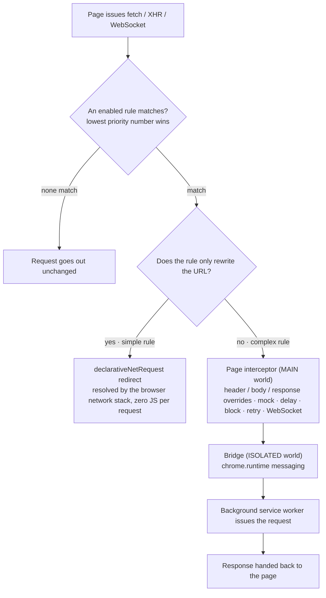

<div align="center">

# Cross-Origin Proxy — CORS debugging, API environment switching & request Mock

[简体中文](./README.md) | **English**

**Point a FAT frontend at a UAT backend with one browser rule — no code changes, no backend CORS edits, no rebuild.**

[](./LICENSE)
[](https://github.com/liaolongdong/cross-origin-proxy/actions/workflows/ci.yml)
[](https://github.com/liaolongdong/cross-origin-proxy/releases)
[](https://developer.chrome.com/docs/extensions/mv3/intro/)
[](#-install)
[](./CONTRIBUTING.md)
[](https://liaolongdong.github.io/cross-origin-proxy/en.html)
[](https://github.com/liaolongdong/cross-origin-proxy/stargazers)
[](https://chromewebstore.google.com/detail/dednngakllblfilbndkaggphohmpgcbg)


**[📥 Install it](#-install) · [⚡ First rule in one minute](#first-rule-in-one-minute) · [🌐 Product site](https://liaolongdong.github.io/cross-origin-proxy/en.html) · [💬 Community](#-community--feedback)**

> Your frontend runs against FAT, the fix you need only exists on UAT. Instead of editing a devServer proxy per project, hardcoding a token, or asking the backend to open CORS and redeploy, you add one rule in Chrome: match `https://fat-api.example.com/*`, target `https://uat-api.example.com`, done. The same rule set can also rewrite headers and responses, mock data, inject latency, block requests and forward WebSocket.

> 🔒 Rules and logs stay on your machine — no telemetry, no backend of ours ｜ 🧪 Vitest coverage of the proxy path ｜ 🎨 6 themes · bilingual UI ｜ 📖 MIT licensed

**Contents**: [Why this exists](#-why-this-exists) · [Interface preview](#-interface-preview) · [Install](#-install) · [What makes it different](#-what-makes-it-different) · [How it compares](#-how-it-compares) · [How it works](#-how-it-works) · [Features](#-features) · [Use cases](#-use-cases) · [FAQ](#-faq) · [Permissions](#-permissions) · [Community](#-community--feedback) · [Contributing](./CONTRIBUTING.md)

</div>

---

## 🎯 Why this exists

Cross-environment debugging normally costs one of three things: a backend change, a config change in every project, or a fake local build. This extension collapses all three into a browser rule.

| Without it                                                                       | With one rule                                                                              |
| -------------------------------------------------------------------------------- | ------------------------------------------------------------------------------------------ |
| Edit the devServer proxy table, restart the dev server                           | Save a wildcard rule; it applies immediately, to every project in the browser              |
| Ask the backend to allow your origin in `Access-Control-Allow-Origin` + redeploy | Advanced-capability requests are issued by the extension, so page CORS checks do not apply |
| Hardcode another environment's token in source and remember to revert it         | Inject the header per rule, switch the rule off when you are done                          |
| Wait for an API that is still being built                                        | Mock the response in the rule; application code stays untouched                            |

Built with [WXT](https://wxt.dev) + Vue 3 + TypeScript + Element Plus + Vite, on Manifest V3.

## 📸 Interface preview

The four screens map to the four everyday actions: **write a rule → check what it matches → see what actually happened → flip the switch**. Click any screenshot for the full-size image.

<table>
  <tr>
    <td width="50%" align="center"><a href="./docs/assets/img/rule-editor.jpg"></a><br /><b>Rule editor</b> — matching / rewriting / header & response overrides / conditional mock / delay / block / retry in one form, with live conflict hints</td>
    <td width="50%" align="center"><a href="./docs/assets/img/url-tester.jpg"></a><br /><b>URL match tester</b> — paste any URL to see the matched rule, rewrite result, forwarding channel and shadowed rules in real time</td>
  </tr>
  <tr>
    <td align="center"><a href="./docs/assets/img/request-log.jpg"></a><br /><b>Request log</b> — last 500 entries, filterable, copy as cURL, HAR export, with per-channel hit statistics</td>
    <td align="center"><a href="./docs/assets/img/popup.jpg"></a><br /><b>Popup</b> — global switch, today's requests, auto-off countdown, current-page hit preview and "create a rule for this page"</td>
  </tr>
</table>

<details>
<summary>Deeper guides · Mock response · delay · block · response modification</summary>

**Mock response** — toggle Mock Response in the rule form, set the status code (default 200), pick a Content-Type (JSON / text / HTML / XML) and paste the body. Useful when the backend API does not exist yet.

**Request delay** — toggle Request Delay and set milliseconds (0–60000). Useful for loading states, skeletons and timeout handling.

**Request blocking** — toggle Block Request. Matched requests receive a network error, which is how you test error handling and offline fallback behaviour.

**Response modification** — expand Response Overrides to set a status code, add or replace response headers, or replace specific JSON fields by dot-notation path (e.g. `data.token` → `"mock-token"`).

</details>

<details>
<summary>Deeper guides · Drag-and-drop ordering · HAR · cURL · log detail viewer</summary>

**Reordering** — drag the ⠿ handle on any row. The table shows rules in array order, and dragging updates both display order and priority values.

**HAR** — the Import/Export dialog exports captured background-channel logs as a `.har` file, redacted or not according to the same **share mode** tick used for config export (on by default), and imports a `.har` file to auto-create rules from recorded traffic (those rules arrive disabled until you enable them).

**cURL import** — paste a cURL command into the Import cURL section (line continuations and single/double quotes supported) and press Parse & Create Rule. A wildcard rule is generated from the request origin with headers and body prefilled.

**Log detail viewer** — click any log row for request URL, headers and body, response headers and text body (JSON auto-formatted; a binary response body is not stored), error details, and a Copy as cURL button that uses the original request URL.

</details>

## 📥 Install

Requires a recent desktop Google Chrome (Manifest V3). We recommend installing from Chrome Web Store, or building from source.

### A. Chrome Web Store (recommended)

Install directly from [Chrome Web Store](https://chromewebstore.google.com/detail/dednngakllblfilbndkaggphohmpgcbg).

### B. GitHub Releases (prebuilt package)

Every `v*` tag on [Releases](https://github.com/liaolongdong/cross-origin-proxy/releases) includes a built zip:

1. Download and unzip the file.
2. Open `chrome://extensions`.
3. Enable **Developer mode** (top right).
4. Click **Load unpacked** and select the unzipped folder (the one containing `manifest.json`).

### C. Build from source

```bash
git clone https://github.com/liaolongdong/cross-origin-proxy
cd cross-origin-proxy
pnpm install
pnpm build
```

Then load `.output/chrome-mv3` unpacked, same three clicks as above.

Either way, once it is installed: click the icon, turn on **Proxy Switch**, add a rule, reload the page.

### First rule in one minute

1. Click the extension icon and turn on **Proxy Switch**.
2. Click **Manage Rules** — the options page opens with the rule form ready.
3. Fill in a rule:

   | Field         | Description                                                                              |
   | ------------- | ---------------------------------------------------------------------------------------- |
   | Match type    | `wildcard` (`https://fat-api.example.com/*`), `prefix`, or `regex`                       |
   | Match pattern | The URL pattern to intercept                                                             |
   | Target URL    | Where matched requests are redirected. Leave empty to forward the original URL unchanged |
   | Priority      | Lower number = matched first                                                             |

4. Reload the page. Requests matching an enabled rule are proxied. A wildcard rewrite like this one runs in the network layer and therefore writes **no per-request log entry** — the popup's "This tab · 5 min" counter shows how many network-layer hits this tab has, and you can also confirm with the **URL match tester** or the DNR hit counts inside **Request Logs**.

## ✨ What makes it different

| Advantage                                        | What it means while you debug                                                                                                                                   |
| ------------------------------------------------ | --------------------------------------------------------------------------------------------------------------------------------------------------------------- |
| ⚡ **Zero JavaScript on the fast path**          | Rules that only rewrite the URL compile to `declarativeNetRequest` redirects, so the browser's network stack does the work — no page-side hook runs per request |
| 🌐 **Reads and rewrites HTTPS with no local CA** | It runs inside the browser: no certificate to install, no proxy port to point DevTools at, no system-wide setting                                               |
| 📝 **Rewrites responses, not just destinations** | Status code, response headers, or single JSON fields by dot path (`data.token`), plus mock bodies chosen by URL / method / query conditions                     |
| 🔌 **Covers WebSocket**                          | `ws://` and `wss://` connections are redirected by the same rule set that handles your HTTP calls                                                               |
| 🔄 **Environments instead of one-off edits**     | Named profiles snapshot the entire rule set for FAT / UAT / PROD, and an auto-off countdown stops the proxy before you forget it is on                          |
| 🔒 **Nothing leaves the machine**                | Rules, logs and profiles live in `chrome.storage.local`; no analytics, no telemetry, no account, no service of its own                                          |
| 📖 **Open source and bilingual**                 | MIT licensed, and both the UI and the documentation ship in English and Chinese                                                                                 |

**Who it fits**

- 💻 **Frontend / client developers** — the page is on FAT and the fix is on UAT: one rule switches it, with no devServer change and no source change
- 🧪 **Test engineers** — mock, latency, block and retry turn "wait for someone to seed data" into a rule you write yourself, so error branches stay reproducible
- 🔧 **Full-stack / backend** — point a deployed frontend at the service on your laptop without asking for a domain or a CORS allow-list first
- 🔁 **Anyone juggling environments** — named profiles swap the whole rule set between FAT / UAT / PRE / PROD instead of re-entering it every time

## 🆚 How it compares

⭐ marks this project. Each row states what a given approach can do out of the box, and matches the [comparison page](https://liaolongdong.github.io/cross-origin-proxy/en-alternatives.html) in this repository.

| What you care about                                 | ⭐ **Cross-Origin Proxy** | Dev-server proxy | System capture proxy | API client            | Header-modifier extension |
| --------------------------------------------------- | ------------------------- | ---------------- | -------------------- | --------------------- | ------------------------- |
| Needs the backend or a gateway to change anything   | ✅ No                     | ⚠️ Often         | ✅ No                | ✅ No                 | ✅ No                     |
| One rule covers every project in the browser        | ✅ Yes                    | ❌ Per project   | ✅ System-wide       | ❌ Only its own calls | ✅ Yes                    |
| Rewrites responses (status, headers, JSON fields)   | ✅ Yes                    | ❌ No            | ✅ Yes               | ⚠️ Mock server        | ⚠️ Response headers only  |
| Mock / latency / block / retry                      | ✅ Conditional mock too   | ❌ Extra plugin  | ✅ Yes               | ✅ Yes                | ⚠️ Usually mock only      |
| Covers WebSocket                                    | ✅ Yes                    | ⚠️ Rare          | ✅ Yes               | ❌ No                 | ❌ No                     |
| Reading HTTPS needs a local CA certificate          | ✅ Not needed             | ✅ Not needed    | ❌ Required          | ✅ Not needed         | ✅ Not needed             |
| Covers non-browser traffic (apps, desktop, servers) | ❌ Browser pages only     | ❌ No            | ✅ Yes               | ⚠️ Its own requests   | ❌ No                     |
| Works in CI without a browser                       | ❌ No                     | ✅ Yes           | ✅ Yes               | ✅ Yes (CLI runner)   | ❌ No                     |

✅ works out of the box · ⚠️ possible with conditions or extra setup · ❌ that approach does not do it.

**When it is the wrong tool**: traffic from a mobile app or a desktop process (use a system capture proxy), a configuration the whole team must review and share (put it in the repository as a dev-server proxy or app config), or an endpoint that does not exist yet and whose shape you still have to agree with the backend (the request in an API client is the shareable artefact). The six criteria with their reasoning are on the comparison page: [English](https://liaolongdong.github.io/cross-origin-proxy/en-alternatives.html) · [中文](https://liaolongdong.github.io/cross-origin-proxy/alternatives.html).

## 🧭 How it works

Every enabled rule is classified from its own fields each time the rule set is synced — the classification is never stored on the rule. Rules that only rewrite the URL become `declarativeNetRequest` dynamic rules and are resolved by the browser's network stack — zero JavaScript per request. Everything richer runs through the background channel. **Proxy Switch** governs both channels: switching it off uninstalls the network-layer rules too, so nothing keeps redirecting once you think it is off.



A rule stops being "simple" as soon as it has any of: request header or body override, response override, mock, delay, block, retry, HTTP method filter, query parameter injection, sending cookies, a `ws://`/`wss://` target, a wildcard that does not end in `*`, or an empty target URL. Those conditions exist because the network layer genuinely cannot express them — see [utils/urlMatcher.ts](./utils/urlMatcher.ts).

**Regex rules must cover the whole URL.** Wildcard and prefix rewrites mean the same thing on both channels. A regex does not: the background channel replaces only the part of the URL your pattern matched and leaves the rest in place, while the network layer replaces the entire URL with the substitution string. So `^https://fat\.example\.com/api/(.*)` targeting `https://uat.example.com/$1` behaves identically either way, but a partial pattern such as `^https://fat\.example\.com/api` keeps `/users` on the background channel and drops it on the network layer. Anchor with `^`, capture the tail with `(.*)$`, and the URL match tester will show you which channel a given URL lands on. One further difference is cosmetic and intentional: when a wildcard's trailing `*` captures nothing (a request for exactly `https://fat.example.com/`), the network layer emits `https://uat.example.com/` while the background channel emits `https://uat.example.com` — the same resource either way.

**CORS, precisely.** Rules on the background channel are issued by the extension, which holds host permissions, and the page receives a response the extension constructed — page CORS checks do not apply. A pure network-layer redirect still gets `Access-Control-Allow-Origin` validated. If a target environment does not allow your origin, add any capability to the rule (a response header override is the cheapest) and it switches channels.

**Top frame and iframes alike.** Content scripts are injected into every frame of the page, so complex rules apply inside an iframe too — a request is not downgraded to a native one just because a subframe issued it. The "self-reported by page" line in the popup sums the frames into a single statement, while cross-checking keeps a separate account per frame: one frame under-reporting never suppresses another frame's reading.

**Did this page get the latest rules?** Complex rules take effect live because the new config is pushed to open pages, and some pages cannot receive that push: the document was already open before the extension was installed, updated or reloaded (so it has no content script at all), or the extension is disabled for the site. Both are fixed by reloading the page, yet until now nothing on screen said so — all the user held was "I changed the rule and this page didn't react". A page whose push never arrived now gets one line in the popup, "This page has not received the latest rules — reload it to apply them", with the two causes and their respective fixes in its tooltip. The line only states what it can be sure of: non-http(s) pages, documents still loading and pages never recorded as missing a push all stay silent, and after the worker is recycled the account restarts empty rather than conjuring a page full of warnings. It is one statement per tab, not one per frame.

**Fallback.** If interception fails, the page falls back to native `fetch` / `XMLHttpRequest` / `WebSocket`, so requests still go out normally. Synchronous XHR (`open()` with `false` as its third argument) falls back the same way, as do non-string bodies such as `FormData` / `Blob` / `ArrayBuffer`: proxying means a round trip through other contexts, which cannot deliver the "the result is ready when `send()` returns" contract — making it async would only hand the page an empty response. Block rules are the deliberate exception: a blocked request is never replayed.

## 📋 Features

### 🔀 Request proxy & modification

- **Rule-based URL rewriting** — match by wildcard, prefix or regex, then redirect to a target environment
- **Request header overrides** — inject or replace headers per rule (e.g. the target environment's auth token)
- **Send cookies** — off by default; a rule that turns it on has the extension send the request with `credentials: 'include'`, so the target environment sees the session you already have there
- **Request body override** — replace the original body with custom content
- **Response modification** — override status code, response headers, or individual JSON fields by dot-notation path (`data.token`)
- **Mock response** — return custom JSON / text / HTML / XML without hitting any server
- **Conditional mock** — attach conditions (URL pattern, HTTP method, query params) and the first match decides the body, status and content type
- **Request delay injection** — 0–60000 ms of artificial latency to exercise loading and timeout states
- **Request blocking** — block matched requests entirely (network error) to test failure and offline fallback paths
- **Retry on failure** — a per-rule switch that adds 1–5 extra attempts after a network error, a 5xx response or the 30-second per-attempt timeout, spaced 100–30000 ms apart (default 1000). **Page cancellation reaches the background**: when the page gives up on a proxied fetch / XHR request (`AbortController` fired, `xhr.abort()`, or the page's own `xhr.timeout` expiring), the extension aborts the upstream request it was running and stops scheduling further retries, logging `Cancelled by page` separately from a timeout (WebSocket connections are made by the page directly, so there is no proxied request to cancel)
- **HTTP method filtering** — restrict a rule to GET/POST/PUT/…; empty means any method
- **Query parameter injection** — append or override query params on the proxied URL (`__env=uat`, gray-release tags) without rewriting the whole URL
- **Credential variables `{{NAME}}`** — header and query-parameter values can be written as `{{UAT_TOKEN}}`, with the real value kept separately under Settings → Credential variables: the rule itself, the exported config file and the configuration sent down to the page all carry nothing but that literal, the value is substituted at the last moment inside the extension-proxied request, and the local log records the unexpanded form too (a WebSocket rule's query params are assembled page-side, where the variable table is not readable, so the form refuses that combination outright instead of letting it fail silently)
- **WebSocket proxying** — redirect `ws://` / `wss://` connections by URL rewrite, handled in the page interceptor; on a socket only the URL rewrite, query parameter injection and blocking apply — header / body / response overrides, mock, delay, retry and sending cookies do not apply (the badge's tooltip says exactly this)

### 🧰 Rule management

- Add / edit / duplicate / delete via a visual form
- **Quick templates** in the empty state, before you have any rules (wildcard API proxy, prefix path, auth header, header override), and **undo** immediately after a delete
- **Drag-and-drop reordering** of priority (grab the ⠿ handle)
- **Capability badges** on every rule: **H** headers · **C** send cookies · **B** body · **R** response · **M** mock · **D** delay · **X** block · **Re** retry · **WS** WebSocket
- Per-rule and batch enable / disable
- **Batch migrate target URLs** — find/replace part of the target domain across selected rules, with a live change preview
- Keyword search across name, pattern and target URL, plus filters by status and match type; **selections survive filtering**, and batch actions only ever hit rules that still exist
- **"Not applied" badge** — a regex rule using syntax RE2 rejects (lookaround, backreferences), or a target URL referencing a capture group that does not exist, is never applied by the browser; such rules are flagged in the list, with the reason and the fix on hover
- **Conflict warning** when the rule being edited is shadowed by a higher-priority rule with the same pattern, so a rule that can never fire does not go unnoticed
- **Hit counts shown as two cells** — the network-layer cell covers a 5-minute window, the background cell is an in-memory counter since the last config change (it restarts from zero when the worker is recycled); the two windows are not addable, so they are no longer summed into one number. Each cell speaks only for its own channel, so "no reading", "quota spent" and "this rule doesn't take that path" all render as "—" rather than 0, each with its own sentence

### 🔍 Logs & debugging

- Request log panel: method, status, duration, plus hit statistics for both channels — DNR over the last 5 minutes and service-worker hits since the last config change (an in-memory count that restarts when the worker is recycled). The DNR read is quota-limited (about 20 calls per 10 minutes), so counts are sampled on demand and say so when they may lag; the popup keeps a separate per-tab network-layer count
- Log detail viewer: request and response headers and text bodies (a binary response body is not stored; a body longer than 32K characters is truncated with its original length annotated), JSON auto-formatted. Headers that carry a session — `Authorization`, `Cookie` and the like — have their values **masked by default** (long values keep their last 4 characters, enough to tell one key from another), and the "Reveal credential values" switch at the top right of the detail panel is never persisted and resets when the drawer closes
- **Copy as cURL** on any log entry, using that request's original URL, and **create a rule** straight from a captured request
- Filter by method (GET / POST / PUT / DELETE / PATCH / OPTIONS / HEAD), status class (2xx / 4xx / 5xx), rule or URL keyword
- **URL match tester** in the header bar: type any URL (optionally with a method) to preview in real time the matched rule, the rewritten URL, the forwarding channel and which other rules match the same URL but lose to it; on the network-layer channel it also states that CORS still applies there

### 📦 Import, export, environments

- Export configuration as JSON with **share mode on by default**: `Authorization`, `Cookie` and similar request/response headers plus token-like query parameters are stripped, and the toast reports how many entries were removed — untick for a complete local backup. Rules built on **credential variables** need no such triage: the real value was never in the config file, the export carries the `{{UAT_TOKEN}}` reference itself, so even unticking share mode sends nothing out
- On import, replace the current rules or merge into them, both capped at 200 rules. Before writing, you can **preview** the file: how many rules would be added, which existing ones are kept over the incoming copy — the merge key is rule name + match pattern, so a rule whose target URL alone changed counts as an **addition**, not an update — and which entries duplicate each other inside the file. Preview and write apply the same criteria, so the two never disagree; a file stamped with a newer schema version is rejected rather than partially read. A failed import **keeps your input and stays open**, so you can fix it and retry
- **Config restore points** — the three operations that replace the whole rule set (replace-import, loading a profile, batch delete) each keep a copy of what they replaced: the last 5 are listed under Settings → Config restore points, and a rollback stores its own point first. A restore point holds rules only (credentials stay `{{NAME}}` references), and rolling back swaps the rule set without ever touching the global proxy switch
- **HAR 1.2** export of captured requests — it follows the same **share mode** tick as config export (on by default), dropping credential-like request/response headers from every entry while leaving bodies and URLs intact (a token sitting in a URL stays yours to handle); untick for a full export. HAR import auto-creates rules from recorded traffic (those rules arrive disabled until you enable them)
- **cURL import** — paste DevTools' "Copy as cURL" output to prefill a rule
- **Environment profiles** — save the current rule set as a named snapshot and switch between FAT / UAT / PROD
- Auto-off countdown (`chrome.alarms`, survives service-worker restarts) and a badge that shows proxy state

### 🎨 Interface

- Popup quick panel: global switch, requests via the extension (background channel only), this tab's network-layer hit count over the last 5 minutes, recent requests, auto-off countdown, **this page's address hit preview** (with network-layer rules Chrome won't apply flagged), and "Create rule for This Page" prefilled from the active tab
- Right under that data row, **only when it has something to say** (this page's address hits a background-channel rule, or a reading already exists), one more line gives **what this page itself reports having intercepted**. The sentence on screen names two of the four counters — how many requests the JS layer caught and how many of those were handed to the background channel (when anything fell back it says how many went native instead, and with no fallback but a timeout the second number is how many never got a response after being handed over); when there is a reading, hovering expands it to all four plus the moment the report was accepted, and states that one request can count in more than one of them so they never add up. The counters accumulate for the current document and reset on navigation. It covers the gap the other three signals can't see — when a complex rule intercepts nothing, "0 requests via the extension" is indistinguishable from "this page made no requests", and a fallback to native or a proxy timeout used to leave nothing but a console warning. Any fallback above zero is called out as "some requests on this page did not go through the proxy", and outranks the timeout sentence, because one line can only carry the thing you most need to know first. These four numbers are reported by the page and can be forged by a script running on that same page (never another tab), so they are a diagnostic clue only: they drive no decision, and the wording always says "page-reported"
- The popup carries one more line, **"This page has not received the latest rules — reload it to apply them"**: complex rules take effect live because the new config is pushed to open pages, and this line appears only when the background actually recorded that a page missed that push (and only with the global switch on, this page proxyable, and the ledger genuinely read this time). Its tooltip names both causes and their respective fixes — the document was open before the extension was installed, updated or reloaded (reload it), or the extension is disabled for the site (re-enable it from Chrome's extension menu). That ledger lives in memory and records known failures only; non-http(s) pages and documents still loading take no part, so "unknown" is never drawn as "broken" and a recycled worker does not conjure a screen full of warnings
- English / 简体中文 UI, six themes with light / dark / system modes
- **Credential variable table** in the settings dialog: name a value, store it once (up to 50, and the value field renders as a password box by default); every variable shows how many rules use it, deleting one that is in use asks for confirmation, and names a rule still references but the table no longer has are listed as an orphan warning instead of surfacing as a failed request
- Keyboard shortcuts: <kbd>⌘</kbd>+<kbd>⇧</kbd>+<kbd>P</kbd> toggle proxy (Chrome-level command), and on the options page <kbd>N</kbd> new rule, <kbd>/</kbd> or <kbd>⌘</kbd>+<kbd>F</kbd> focus search, <kbd>Esc</kbd> close the topmost dialog. <kbd>N</kbd> is a bare key, like Gmail — <kbd>⌘</kbd>+<kbd>N</kbd> is reserved by the browser and cannot be captured.

## 🚀 Use cases

| Situation                                     | Rule configuration                                 |
| --------------------------------------------- | -------------------------------------------------- |
| Verify a UAT-only fix from a FAT page         | Wildcard rewrite of the API prefix to the UAT host |
| Build UI before the backend exists            | Mock response with a crafted body and status       |
| Prove loading and timeout paths               | Delay of 3000–60000 ms on the endpoint             |
| Check offline / 500 fallback UI               | Block the request, or override the response status |
| Exercise a gray-release or A/B branch         | Query parameter injection                          |
| Debug a real-time feature against another env | WebSocket rewrite                                  |
| Send only writes to the test backend          | Method filter on `POST` / `PUT` / `DELETE`         |
| Hand the same setup to a teammate             | Export JSON (credentials stripped) or HAR rules    |

## ❓ FAQ

<details open>
<summary><strong>Does this bypass CORS?</strong></summary>

For rules on the background channel, yes — the extension issues the request and hands the page a constructed response, so page CORS checks never run. A pure URL rewrite becomes a network-layer redirect, and the browser still validates `Access-Control-Allow-Origin` on the redirected response. Add any capability to the rule to move it to the background channel.

</details>

<details>
<summary><strong>Does it work on any site?</strong></summary>

Content scripts run on all `http` / `https` pages and rules match on request URL, so internal tools, `localhost` dev servers and staging domains all work. Chrome blocks extensions on `chrome://` pages, the Web Store and other extension pages.

</details>

<details>
<summary><strong>I changed a rule but this page did not react?</strong></summary>

Most often it is not the rule: this page never received the new config, because its document was open **before** the extension was installed, updated or reloaded (so it has no content script at all), or the extension is disabled for that site. The first is fixed by reloading, the second by re-enabling the extension for the site from Chrome's extension menu. When a push really did miss the page, the popup states exactly that and its tooltip gives both causes with their respective fixes; if there is no record to read it says nothing rather than turning "unknown" into "broken". For the rule itself, use the URL match test: which rule this address hits, which channel it takes, and whether a broader one shadows it.

</details>

<details>
<summary><strong>Is any data sent anywhere?</strong></summary>

No. Rules, logs, profiles and preferences stay in `chrome.storage.local`. There is no analytics, no telemetry and no remote service; the only network traffic is the API traffic you ask it to proxy. See the [privacy policy](https://liaolongdong.github.io/cross-origin-proxy/privacy.html) (both languages on one page).

One local caveat worth knowing: the request log stores the headers and bodies it proxies, which can include tokens. Nothing leaves the machine, but clear the log before pasting a detail view or taking a screenshot — in the detail view the values of `Authorization` / `Cookie` and similar headers are already masked (turn on "Reveal credential values" only while you are matching a tail character on screen, and it is gone once the drawer closes). Both config export and HAR export default to share mode, which strips `Authorization`, `Cookie` and similar headers — config export additionally strips token-like query-parameter overrides — untick it for a full backup, and treat those files as sensitively as the log. Once a rule points at a credential slot through a `{{NAME}}` reference into Settings → Credential variables, the real value exists in exactly one place: neither the exported config file nor a profile snapshot ever contained it, and unticking share mode does not change that.

</details>

<details>
<summary><strong>Why is my rule using the slow channel?</strong></summary>

Because it has a capability the network layer cannot express, or because it is a wildcard not ending in `*` / has an empty target — both would silently change the redirect result if compiled anyway. The URL match tester shows the channel for any URL.

</details>

<details>
<summary><strong>What are the limits?</strong></summary>

200 rules, the last 500 log entries (each stored body capped at 32K characters, with the original length annotated; URLs, methods, rule names and header values at 8K characters, at most 64 headers per map, and a 4M-character budget across the whole log), 10 MB request body, 0–60000 ms delay, and mocked status codes clamped to 200–599 so the page can always build a valid `Response`.

</details>

<details>
<summary><strong>Firefox or Edge?</strong></summary>

Built and tested for Chrome (MV3). Edge runs Chromium extensions so the same build normally works; Firefox is not a supported target today because of `declarativeNetRequest` differences.

</details>

## 🔐 Permissions

| Permission                      | Why needed                                                              |
| ------------------------------- | ----------------------------------------------------------------------- |
| `storage`                       | Persist rules, logs, profiles and preferences                           |
| `declarativeNetRequest`         | Network-layer redirects for simple rules (zero JS per request)          |
| `declarativeNetRequestFeedback` | Rule hit statistics shown in the log drawer                             |
| `alarms`                        | Service-worker keepalive and the auto-off countdown                     |
| `<all_urls>` (host permission)  | Proxying must work on any frontend origin; targets are your own domains |

Every permission also has a store-facing justification in [CHROMEWEBSTORE.md](./CHROMEWEBSTORE.md).

## 🤝 Contributing

Built with WXT + Vue 3 + TypeScript + Element Plus (Manifest V3); requires Node.js 20+ and pnpm 10 — `pnpm dev` for HMR development, `pnpm build` for `.output/chrome-mv3`, `pnpm test` for unit tests. Small fixes are welcome. The full command list, repository layout, CI and release conventions are in [CONTRIBUTING.md](./CONTRIBUTING.md); the store runbook is [RELEASING.md](./RELEASING.md) and the one-time GitHub repo checklist is [GITHUB.md](./GITHUB.md).

## 💬 Community & feedback

How to write a rule, why a request did not get proxied, workarounds for a specific environment — the author hangs out in the WeChat group and answers there. The group speaks Chinese, so if you prefer English, open a GitHub Issue instead.


Scan to add the author on WeChat (ID: `lld_1025`) and put **`cxp`** in the friend request note (`cross`→cx + `proxy`→p); you will be pulled into the group.

- No WeChat: mail [924902324@qq.com](mailto:924902324@qq.com?subject=Cross-Origin%20Proxy%20feedback)
- Bugs and feature requests belong in [GitHub Issues](https://github.com/liaolongdong/cross-origin-proxy/issues): attach the request log and a rules export — much easier to diagnose than a screenshot
- Product site: [English](https://liaolongdong.github.io/cross-origin-proxy/en.html) · [中文](https://liaolongdong.github.io/cross-origin-proxy/)

## 🧩 Other extensions by me

- ⭐ [Account Password Helper · 账号密码管理助手](https://github.com/liaolongdong/account-password-helper) — another Manifest V3 extension by the same author: a local-first open-source password manager that clicks the login button for you, isolates dev / test / staging / prod by exact host, and ships TOTP plus an offline security audit. It answers "who am I in this environment", this one answers "where do this environment's requests go" — the two are often on together while debugging. [Product page](https://liaolongdong.github.io/account-password-helper/) · [Chrome Web Store](https://chromewebstore.google.com/detail/account-password-helper/fgimkdodpjfkddmildjieojpfakpanli)
- [Transfer Any File](https://github.com/liaolongdong/transfer-any-file) — another Manifest V3 extension by the same author: an offline converter that turns 14 formats into each other inside the browser without uploading a byte. Markdown, Word, PDF, Excel, CSV, JSON, HTML and images convert on your own machine, with mixed-format batches, automatic multi-step chains, preview and inline editing, and ZIP packaging. No account, no upload, no network request. [Product page](https://liaolongdong.github.io/transfer-any-file/)

## 📄 License

[MIT](./LICENSE) · Copyright (c) 2026 Better

---

<div align="center">

**If this saved you a backend deploy, a star helps others find it:**

[](https://github.com/liaolongdong/cross-origin-proxy/stargazers)
&nbsp;
[](https://liaolongdong.github.io/cross-origin-proxy/en.html)

<br/>

Product site: [English](https://liaolongdong.github.io/cross-origin-proxy/en.html) · [中文](https://liaolongdong.github.io/cross-origin-proxy/) · [Comparison](https://liaolongdong.github.io/cross-origin-proxy/en-alternatives.html) · [Privacy policy](https://liaolongdong.github.io/cross-origin-proxy/privacy.html) · machine-readable: [llms.txt](https://liaolongdong.github.io/cross-origin-proxy/llms.txt) · [llms-full.txt](https://liaolongdong.github.io/cross-origin-proxy/llms-full.txt)

</div>
