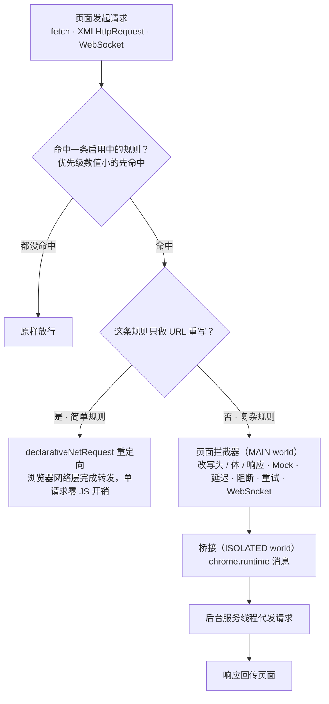
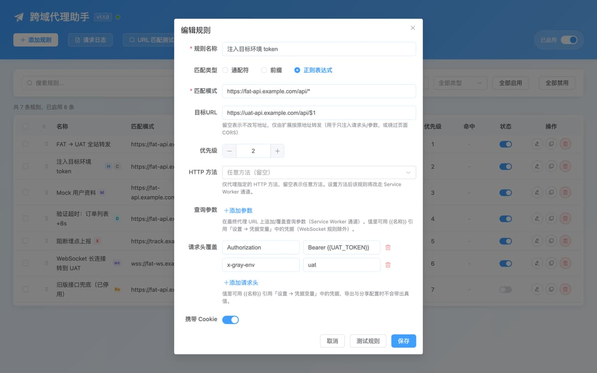
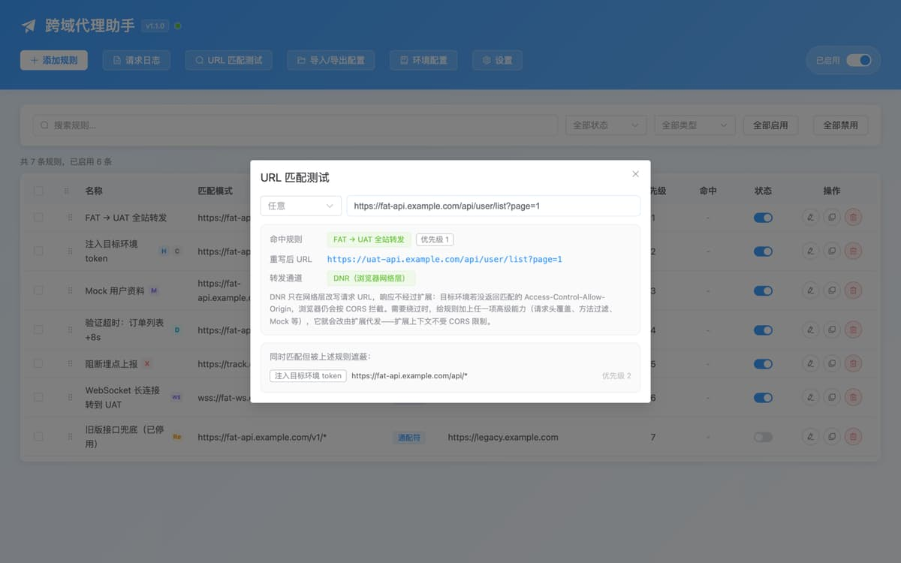
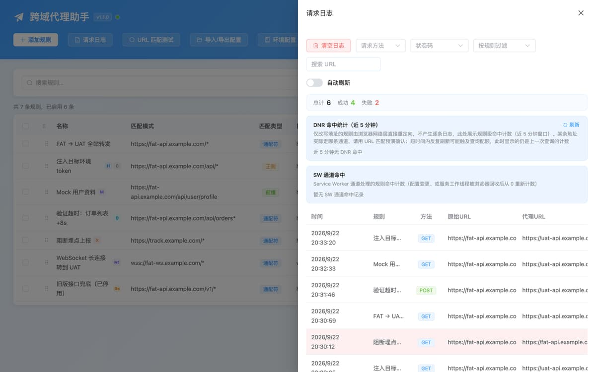
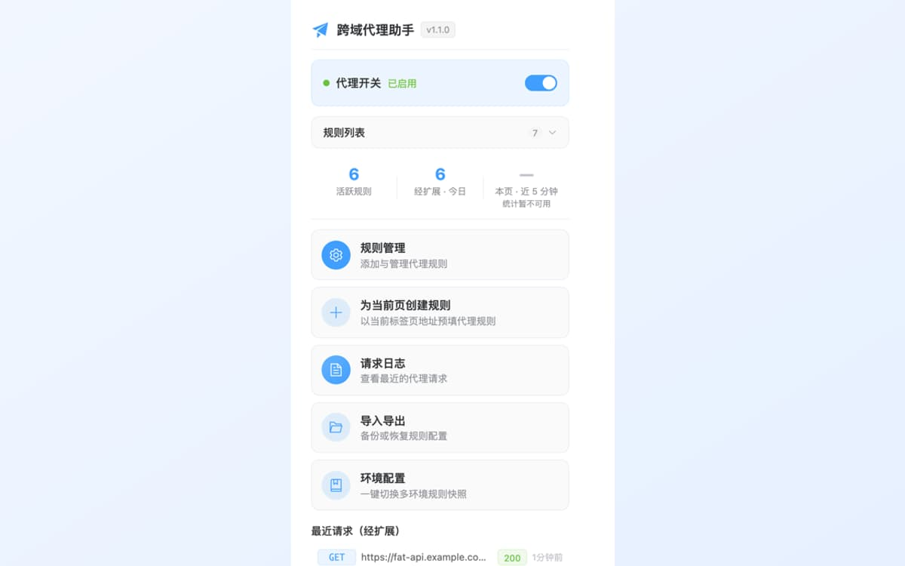

<div align="center">

# 跨域代理助手 - CORS 跨域调试 · API 环境切换 · Mock

**简体中文** | [English](./README.en.md)

**一条浏览器规则，把 FAT 前端指到 UAT 后端——不改代码、不改后端 CORS、不用重新构建。**

[](https://github.com/liaolongdong/cross-origin-proxy/stargazers)

<br/>


[](./LICENSE)
&nbsp;
[](https://github.com/liaolongdong/cross-origin-proxy/actions/workflows/ci.yml)
&nbsp;
[](https://github.com/liaolongdong/cross-origin-proxy/releases)
&nbsp;
[](https://liaolongdong.github.io/cross-origin-proxy/)
&nbsp;
[](https://developer.chrome.com/docs/extensions/mv3/intro/)
&nbsp;
[](#-安装)
&nbsp;
[](./CONTRIBUTING.md)

> 页面连着 FAT，你要的修复只在 UAT。传统做法要么改每个项目的 devServer 代理、要么硬塞一个 token、要么请后端放开 CORS 再发一次版。这里只需要在 Chrome 里加一条规则：匹配 `https://fat-api.example.com/*`，目标 `https://uat-api.example.com`。同一套规则还能改写请求头与响应、Mock 数据、注入延迟、阻断请求、转发 WebSocket。

> 🌐 **[产品站](https://liaolongdong.github.io/cross-origin-proxy/)** ｜ ⚙️ Chrome Manifest V3 ｜ 🔒 规则与日志只存本机 ｜ 🧪 Vitest 单测覆盖代理与改写链路 ｜ 🎨 6 套主题 · 中英双语

**目录**：[它解决的是什么](#-它解决的是什么) · [核心优势](#-核心优势) · [横向对比](#-横向对比) · [安装](#-安装) · [工作原理](#-工作原理) · [功能](#-功能) · [界面预览](#-界面预览) · [使用场景](#-使用场景) · [常见问题](#-常见问题) · [权限](#-权限) · [交流与反馈](#-交流与反馈) · [参与贡献](./CONTRIBUTING.md)

</div>

---

## 🎯 它解决的是什么

跨环境联调通常要付出三样代价之一：改后端、改每个项目的配置、或者在本地伪造一份构建。这个扩展把它们收敛成浏览器里的一条规则。

| 不用它                                                    | 用一条规则                                             |
| --------------------------------------------------------- | ------------------------------------------------------ |
| 改 devServer 代理表，然后重启本地服务                     | 保存一条通配规则，立刻生效，且对浏览器里所有项目都生效 |
| 请后端把来源加进 `Access-Control-Allow-Origin` 并重新发版 | 带高级能力的请求由扩展代发，页面侧不触发 CORS 校验     |
| 在源码里硬写另一个环境的 token，还得记得改回来            | 按规则注入请求头，联调完把这条规则关掉                 |
| 接口还没写好，只能先在前端塞假数据                        | 在规则里 Mock 响应，业务代码一行不动                   |

技术栈：[WXT](https://wxt.dev) + Vue 3 + TypeScript + Element Plus + Vite，Manifest V3。

## ✨ 核心优势

| 优势                              | 联调时意味着什么                                                                                                |
| --------------------------------- | --------------------------------------------------------------------------------------------------------------- |
| ⚡ **快通道上零 JS**              | 只重写 URL 的规则编译成 `declarativeNetRequest` 重定向，由浏览器网络栈完成转发，每个请求不会跑一段页面侧钩子    |
| 🌐 **不装本地 CA 也能改写 HTTPS** | 它运行在浏览器内部：不必安装证书、不必把 DevTools 指到某个代理端口、不动系统级设置                              |
| 📝 **改写的是响应，不只是目的地** | 状态码、响应头，或按点分路径替换单个 JSON 字段（`data.token`）；Mock 还能按 URL / 方法 / 查询参数条件挑选响应体 |
| 🔌 **覆盖 WebSocket**             | `ws://` 与 `wss://` 长连接用同一套规则重写，不必另配                                                            |
| 🔄 **管的是环境，不是一次性改动** | 环境配置快照把整套规则存成命名快照，在 FAT / UAT / PROD 间一键切换；自动关闭倒计时在你忘记之前把代理关掉        |
| 🔒 **数据不出本机**               | 规则、日志与环境配置全部留在 `chrome.storage.local`：无统计埋点、无遥测、无账号、也没有自有服务端               |
| 📖 **开源且双语**                 | MIT 协议，界面与文档同时提供中英文两版                                                                          |

**适合谁**

- 💻 **前端 / 客户端开发** — 页面停在 FAT，修复在 UAT：一条规则切过去，不动 devServer、不动源码
- 🧪 **测试工程师** — Mock、延迟、阻断、重试把「等后端造数据」变成自己配一条规则，异常分支也能稳定复现
- 🔧 **全栈 / 后端** — 本地服务起来后，让已部署的前端直接调你这台机器，不必先申请域名与 CORS 白名单
- 🔁 **多环境切换频繁的人** — 命名快照在 FAT / UAT / PRE / PROD 间一键换，不用每次重填一遍规则

## 🆚 横向对比

⭐ 为本项目。各行结论取自各方案的公开能力，与本仓库[方案对比页](https://liaolongdong.github.io/cross-origin-proxy/alternatives.html)一致。

| 关心的事                                       | ⭐ **跨域代理助手** | Dev Server 代理 | 系统级抓包代理 | API 客户端          | 改请求头的扩展   |
| ---------------------------------------------- | ------------------- | --------------- | -------------- | ------------------- | ---------------- |
| 需要后端 / 网关配合改动                        | ✅ 不需要           | ⚠️ 常需要       | ✅ 不需要      | ✅ 不需要           | ✅ 不需要        |
| 一次配置对浏览器里所有项目生效                 | ✅ 是               | ❌ 每个项目一份 | ✅ 系统级      | ❌ 只发自己的请求   | ✅ 是            |
| 改写响应（状态码 / 响应头 / JSON 字段）        | ✅ 是               | ❌ 否           | ✅ 是          | ⚠️ Mock 服务        | ⚠️ 仅响应头      |
| Mock / 延迟 / 阻断 / 重试                      | ✅ 含条件化 Mock    | ❌ 需额外插件   | ✅ 是          | ✅ 是               | ⚠️ 通常只有 Mock |
| 覆盖 WebSocket                                 | ✅ 是               | ⚠️ 少见         | ✅ 是          | ❌ 否               | ❌ 否            |
| 读取 HTTPS 需要装本机 CA 证书                  | ✅ 不需要           | ✅ 不需要       | ❌ 需要        | ✅ 不需要           | ✅ 不需要        |
| 覆盖非浏览器流量（手机 App、桌面、服务端进程） | ❌ 只在浏览器内     | ❌ 否           | ✅ 能          | ⚠️ 只覆盖它自己发的 | ❌ 否            |
| 无需浏览器即可在 CI 里跑                       | ❌ 否               | ✅ 是           | ✅ 是          | ✅ 是（CLI runner） | ❌ 否            |

✅ 开箱即用 · ⚠️ 有条件或需额外配置 · ❌ 该方案做不到。

**什么时候别用它**：需要覆盖手机 App 或桌面程序的流量（走系统级抓包代理）、需要一份能被 review 且全团队共用的配置（写进仓库的 devServer 代理或应用配置）、接口本身还不存在且需要先跟后端约定形状（API 客户端里那份请求才是可分享的产物）。六条判据与理由在对比页写全了：[中文](https://liaolongdong.github.io/cross-origin-proxy/alternatives.html) · [English](https://liaolongdong.github.io/cross-origin-proxy/en-alternatives.html)。

## 📥 安装

需要较新版本的桌面 Google Chrome（Manifest V3）。Chrome 应用商店上架准备中，在此之前走下面两条路径之一。

### 方式 A：下载预构建包（不需要工具链）

发布工作流会在每个 `v*` tag 上把构建好的 zip 挂到 [Releases](https://github.com/liaolongdong/cross-origin-proxy/releases)；首个 tag 打出来之前请先用下面的方式 B。有 Release 之后，下载 zip 并解压，然后：

1. 打开 `chrome://extensions`。
2. 开启右上角「开发者模式」。
3. 点「加载已解压的扩展程序」，选中解压出来的目录（含 `manifest.json` 的那层）。

### 方式 B：从源码构建

```bash
git clone https://github.com/liaolongdong/cross-origin-proxy
cd cross-origin-proxy
pnpm install
pnpm build
```

按上面同样三步加载 `.output/chrome-mv3`。

两种安装方式结果一致：装好后点图标打开**代理开关**，加一条规则，刷新页面。

### 一分钟配出第一条规则

1. 点扩展图标，打开**代理开关**。
2. 点弹窗里的**规则管理**——配置页会带着新建规则表单打开。
3. 填写规则：

   | 字段     | 说明                                                          |
   | -------- | ------------------------------------------------------------- |
   | 匹配类型 | `通配符`（`https://fat-api.example.com/*`）、`前缀` 或 `正则` |
   | 匹配模式 | 要拦截的 URL 模式                                             |
   | 目标 URL | 命中后转发到的地址；留空则不改写地址，仅由扩展按原地址转发    |
   | 优先级   | 数值越小越先匹配                                              |

4. 刷新页面。命中已启用规则的请求会被代理。但像上面这种通配符重写走的是网络层，**不会留下逐条请求日志**——请用 **URL 匹配预演**，或到**请求日志**里看 DNR 命中统计来确认。

## 🧭 工作原理

每条启用的规则在每次配置同步时按其自身字段重新判定一次，判定结果并不存储在规则上。只做 URL 重写的规则会编译成 `declarativeNetRequest` 动态规则，交给浏览器网络栈处理，单个请求零 JS 开销；能力更全的规则走后台通道。**代理开关**管住两条通道：关掉它时网络层规则同样会被卸载，不会出现「以为关了、其实还在重定向」。



规则一旦带上下列任一项就不再是「简单规则」：请求头改写、请求体改写、响应改写、Mock、延迟、阻断、重试、HTTP 方法过滤、查询参数注入、`ws://`/`wss://` 目标、不以 `*` 结尾的通配符、目标地址留空。这些条件不是因为实现偷懒，而是网络层确实无法表达，详见 [utils/urlMatcher.ts](./utils/urlMatcher.ts)。

**正则规则要覆盖整个 URL。** 通配符与前缀的重写在两条通道上语义一致，正则却不一定：后台通道只替换模式匹配到的那一段，未匹配的部分原样保留；网络层则用替换串整体替换掉整个 URL。所以 `^https://fat\.example\.com/api/(.*)` 配 `https://uat.example.com/$1` 两边结果相同，而 `^https://fat\.example\.com/api` 这种不完整模式在后台通道会留下 `/users`，在网络层会直接丢掉。用 `^` 锚定、用 `(.*)$` 捕获结尾，两者就一致；具体某条地址走哪条通道，URL 匹配预演会告诉你。还有一处刻意保留的外观差异：通配符末尾的 `*` 什么都没捕到时（请求正好是 `https://fat.example.com/`），网络层给出 `https://uat.example.com/`，后台通道给出 `https://uat.example.com`——两者指向的是同一个资源。

**关于 CORS，说准确一点。** 后台通道的请求由扩展（持有站点权限）发出，页面拿到的是扩展构造的响应，因此不受页面 CORS 校验约束。而纯网络层重定向，浏览器仍会校验重定向后响应的 `Access-Control-Allow-Origin`。如果目标环境没放行你的来源，给规则加上任意一项能力（最省事的是加个响应头改写），它就切到后台通道。

**兜底行为。** 拦截失败时页面会回退到原生 `fetch` / `XMLHttpRequest` / `WebSocket`，请求照常发出，不会因为扩展异常而中断。阻断规则是唯一的例外——被阻断的请求绝不回退发出。

## 📋 功能

### 🔀 代理与请求改写

- **规则化 URL 重写**——按通配符、前缀、正则匹配后转发到目标环境
- **请求头改写**——按规则注入或替换请求头（例如目标环境的鉴权 token）
- **请求体改写**——用自定义内容替换原始请求体
- **响应改写**——改写响应状态码、响应头，或按点分路径替换 JSON 字段（如 `data.token`）
- **Mock 响应**——不访问任何服务，直接返回自定义 JSON / 文本 / HTML / XML
- **条件化 Mock**——可挂多组条件（URL 正则、HTTP 方法、查询参数），首个命中的条件决定响应体、状态码与 Content-Type
- **延迟注入**——0–60000 毫秒人工延迟，用来验证加载态与超时分支
- **请求阻断**——命中即网络错误，用来验证异常处理与离线兜底
- **失败重试**——按规则开启的开关，在网络错误、5xx 响应或单次 30 秒超时之后追加 1–5 次尝试，间隔 100–30000 毫秒（默认 1000）
- **HTTP 方法过滤**——把规则限定在指定方法（GET/POST/PUT…），留空表示任意方法
- **查询参数注入**——在最终代理地址上追加或覆盖参数（`__env=uat`、灰度标识），不必整段重写 URL
- **WebSocket 代理**——按 URL 重写转发 `ws://` / `wss://` 连接，由页面拦截器处理

### 🧰 规则管理

- 可视化表单新增 / 编辑 / 复制 / 删除
- **快速模板**在规则为空时的引导区提供，覆盖常见写法（通配符 API 代理、前缀路径、鉴权头、自定义头覆盖）；删除后还可立即**撤销**
- **拖拽排序**优先级（拖动 ⠿ 手柄）
- **能力徽标**一眼看清规则做了什么：**H** 请求头 · **B** 请求体 · **R** 响应 · **M** Mock · **D** 延迟 · **X** 阻断 · **Re** 重试 · **WS** WebSocket
- 单条与批量启用 / 禁用
- **批量迁移目标域名**——选中多条规则做查找替换，带逐条变更预览
- 关键字搜索覆盖名称、匹配模式与目标地址，另可按状态和匹配类型筛选
- **遮蔽冲突提示**——当被同模式更高优先级规则遮蔽时，编辑中即时提醒，避免写下一条永远不会命中的规则

### 🔍 日志与调试

- 请求日志面板：方法、状态、耗时，以及两条通道各自的命中统计（DNR 近 5 分钟、后台服务线程自配置变更起，后者为内存计数，后台工作线程被回收后从 0 重新开始）
- 日志详情：可看请求与响应的头与文本 body（二进制响应体不落盘），JSON 自动格式化
- 任意一条日志**复制为 cURL**（按原始请求地址），也可直接**由这条请求创建规则**
- 按方法（GET / POST / PUT / DELETE）、状态类别（2xx / 4xx / 5xx）、规则、URL 关键字筛选
- 顶栏**URL 匹配预演**：输入任意地址（可再选 HTTP 方法），实时看到命中规则、重写后的地址、转发通道，以及还有哪些规则同样命中、但被它遮蔽

### 📦 导入导出与环境

- 配置以 JSON 导出；导入支持覆盖或合并两种模式
- **HAR 1.2** 导出抓到的请求；导入 HAR 会依据录制请求自动生成代理规则（新规则默认停用，确认后自行启用）
- **cURL 导入**——粘贴 DevTools 的 Copy as cURL 结果即可解析并预填规则
- **环境配置快照**——把当前规则集存成命名快照，在 FAT / UAT / PROD 间一键切换
- 自动关闭倒计时（基于 `chrome.alarms`，后台脚本重启后仍然有效）与状态徽章

### 🎨 界面

- 弹窗快捷面板：总开关、今日请求数（只统计后台通道）、最近请求、自动关闭倒计时、**当前页面命中预演**，以及按当前标签页预填的「为本页创建规则」
- 中英文界面，6 套主题 + 浅色 / 深色 / 跟随系统
- 快捷键：<kbd>⌘</kbd>+<kbd>⇧</kbd>+<kbd>P</kbd> 切换代理（Chrome 级命令）；配置页内 <kbd>N</kbd> 新建规则、<kbd>/</kbd> 或 <kbd>⌘</kbd>+<kbd>F</kbd> 聚焦搜索、<kbd>Esc</kbd> 关闭最上层弹窗。<kbd>N</kbd> 是单键（同 Gmail 风格），因为 <kbd>⌘</kbd>+<kbd>N</kbd> 被浏览器保留、页面捕获不到

## 📸 界面预览

<table>
  <tr>
    <td width="50%" align="center"><br /><b>规则编辑器</b>——匹配 / 重写 / 请求头与响应覆盖 / 条件化 Mock / 延迟 / 阻断 / 重试，一个表单配齐，带实时冲突提示</td>
    <td width="50%" align="center"><br /><b>URL 匹配预演</b>——粘贴任意地址，实时查看命中规则、重写结果、转发通道与被遮蔽规则</td>
  </tr>
  <tr>
    <td align="center"><br /><b>请求日志</b>——最近 500 条，可筛选、复制为 cURL、导出 HAR，含两条通道各自的命中统计</td>
    <td align="center"><br /><b>弹窗</b>——总开关、今日请求、自动关闭倒计时、当前页命中预演与「为本页创建规则」</td>
  </tr>
</table>

<details>
<summary>更多操作细节 · Mock 响应 · 延迟 · 阻断 · 响应改写</summary>

**Mock 响应**——在规则表单里打开 Mock Response，设置状态码（默认 200），选择 Content-Type（JSON / 文本 / HTML / XML），粘贴响应内容。后端接口还没就绪时最实用。

**请求延迟**——打开 Request Delay，设置毫秒数（0–60000），用来验证加载态、骨架屏与超时处理。

**请求阻断**——打开 Block Request。命中请求直接收到网络错误，这就是验证异常处理与离线兜底的方式。

**响应改写**——展开 Response Overrides，可设置状态码、新增或覆盖响应头，或按点分路径替换指定 JSON 字段（如 `data.token` → `"mock-token"`）。

</details>

<details>
<summary>更多操作细节 · 拖拽排序 · HAR · cURL · 日志详情</summary>

**拖拽排序**——拖动任意行的 ⠿ 手柄。表格按数组顺序展示，拖拽会同时更新展示顺序与优先级数值。

**HAR**——导入导出对话框里「导出 HAR」会把后台通道抓到的请求下载为 `.har`；「导入 HAR」会依据录制条目自动创建代理规则（新规则默认停用，确认后自行启用）。

**cURL 导入**——把 cURL 命令粘贴到「导入 cURL」区域（支持续行符与单双引号），点「解析并创建规则」。扩展会根据请求来源生成通配规则，并把请求头与请求体预填到改写区，确认后保存即生效。

**日志详情**——点击任意日志行展开详情：请求 URL、请求头、请求体、响应头与文本响应体（JSON 自动格式化；二进制响应体不落盘）、错误信息，以及「复制为 cURL」按钮（按原始请求地址生成）。

</details>

## 🚀 使用场景

| 场景                           | 怎么配                                     |
| ------------------------------ | ------------------------------------------ |
| 在 FAT 页面验证只在 UAT 的改动 | API 前缀通配重写到 UAT 域名                |
| 后端还没开发完，先把前端做完   | Mock 响应，自定义 body 与状态码            |
| 验证加载态、骨架屏与超时       | 对指定接口注入 3000–60000 毫秒延迟         |
| 验证 500 与离线兜底 UI         | 阻断请求，或改写响应状态码                 |
| 走灰度分支或 A/B 策略          | 查询参数注入                               |
| 联调实时推送等长连接           | WebSocket 重写                             |
| 只把写操作打到测试后端         | 方法过滤，仅放行 `POST` / `PUT` / `DELETE` |
| 把同一套配置交给同事           | 导出 JSON，或分享由 HAR 生成的规则集       |

## ❓ 常见问题

<details open>
<summary><strong>它能绕过 CORS 吗？</strong></summary>

后台通道的规则可以：请求由持有站点权限的扩展发出，页面拿到的是扩展构造的响应，页面侧 CORS 校验不会触发。纯 URL 重写会被编译成网络层重定向，浏览器仍会校验 `Access-Control-Allow-Origin`。给规则加上任意一项能力，它就切到后台通道。

</details>

<details>
<summary><strong>所有网站都能用吗？</strong></summary>

内容脚本注入全部 `http` / `https` 页面，规则按请求 URL 匹配，内网系统、`localhost` 开发服务、预发域名都适用。`chrome://` 页面、应用商店页与其他扩展页面是 Chrome 对所有扩展的统一限制，无法注入。

</details>

<details>
<summary><strong>数据会被上传吗？</strong></summary>

不会。规则、日志、环境配置与偏好全部留在本机 `chrome.storage.local`，没有统计埋点，也不连接任何自有服务，唯一的网络流量就是你要求代理的 API 流量。详见[隐私政策](https://liaolongdong.github.io/cross-origin-proxy/privacy.html)（中英双语同页）。

一个只涉及本机的提醒：请求日志会存下被代理的请求头与请求体，里面可能包含 token。数据不出机器，但分享 HAR 导出或截图之前请先清空日志。

</details>

<details>
<summary><strong>为什么我的规则走的是慢通道？</strong></summary>

因为它带了网络层无法表达的能力；也可能是通配符不以 `*` 结尾、或目标地址留空——这两种情况若强行编译成重定向会静默改变结果。用 URL 匹配预演就能看到每条地址实际走的通道。

</details>

<details>
<summary><strong>有哪些限制？</strong></summary>

规则 200 条、日志最近 500 条、请求体上限 10MB、延迟 0–60000 毫秒；Mock 与响应改写的状态码钳制在 200–599，否则前端构造不出合法的 `Response`。

</details>

<details>
<summary><strong>支持 Firefox 或 Edge 吗？</strong></summary>

按 Chrome（MV3）构建与验证。Edge 兼容 Chromium 扩展，同一份构建通常可用；Firefox 因 `declarativeNetRequest` 支持差异，目前不作为支持目标。

</details>

## 🔐 权限

| 权限                            | 用途                                               |
| ------------------------------- | -------------------------------------------------- |
| `storage`                       | 本地保存规则、日志、环境配置与偏好                 |
| `declarativeNetRequest`         | 为简单规则安装网络层重定向，做到单请求零 JS 开销   |
| `declarativeNetRequestFeedback` | 读取规则命中情况，用于日志抽屉的命中统计           |
| `alarms`                        | 后台脚本保活与自动关闭倒计时                       |
| `<all_urls>`（站点权限）        | 代理必须能在任意前端来源上工作，目标域名由你自己配 |

每项权限面向商店审核的说明文案在 [CHROMEWEBSTORE.md](./CHROMEWEBSTORE.md)。

## 🤝 参与贡献

技术栈为 WXT + Vue 3 + TypeScript + Element Plus（Manifest V3），需要 Node.js 20+ 与 pnpm 10；`pnpm dev` 起 HMR 开发、`pnpm build` 产出 `.output/chrome-mv3`、`pnpm test` 跑单测。小修复也欢迎——完整命令清单、目录结构、CI 与发版约定请先读 [CONTRIBUTING.md](./CONTRIBUTING.md)，商店发布流程见 [RELEASING.md](./RELEASING.md)，GitHub 仓库设置清单见 [GITHUB.md](./GITHUB.md)。

## 💬 交流与反馈

规则怎么写、代理为什么没生效、某个环境下的坑怎么绕，都可以在群里问，作者本人常驻群里。


扫码添加作者微信（微信号：`lld_1025`），好友请求备注 **`cxp`**（`cross`→cx、`proxy`→p 的缩写），通过后拉进交流群。

- 不方便用微信：写信到 [924902324@qq.com](mailto:924902324@qq.com?subject=%E8%B7%A8%E5%9F%9F%E4%BB%A3%E7%90%86%E5%8A%A9%E6%89%8B%E5%8F%8D%E9%A6%88)
- 缺陷与功能请求优先开 [GitHub Issue](https://github.com/liaolongdong/cross-origin-proxy/issues)：带上请求日志与规则配置导出，比截图更好定位
- 产品站：[中文](https://liaolongdong.github.io/cross-origin-proxy/) · [English](https://liaolongdong.github.io/cross-origin-proxy/en.html)

## 🧩 我的其它插件

- ⭐ [账号密码管理助手 · Account Password Helper](https://github.com/liaolongdong/account-password-helper)：同一作者的另一款 Manifest V3 扩展，本地优先的开源密码管理器——一键登录连登录按钮一起点，按精确域名隔离 dev / test / staging / prod，内置 TOTP 两步验证与离线安全体检。它处理「这个环境我是谁」，本扩展处理「这个环境请求打到哪」，联调时常常一起开着。[产品页](https://liaolongdong.github.io/account-password-helper/) · [Chrome 应用商店](https://chromewebstore.google.com/detail/account-password-helper/fgimkdodpjfkddmildjieojpfakpanli)
- [Transfer Any File](https://github.com/liaolongdong/transfer-any-file)：同一作者的另一款 Manifest V3 扩展，14 种格式在浏览器里互转、一个字节也不上传的离线文件转换器——Markdown、Word、PDF、Excel、CSV、JSON、HTML 与图片在自己电脑上完成转换，支持批量混合格式、自动多步链路、预览与内联编辑、ZIP 打包。无账号、无上传、无网络请求。[产品页](https://liaolongdong.github.io/transfer-any-file/)

## 📄 许可证

[MIT](./LICENSE) · Copyright (c) 2026 Better

---

<div align="center">

**如果它帮你省掉了一次后端发版，点个 Star 让更多前端同学看到它：**

[](https://github.com/liaolongdong/cross-origin-proxy/stargazers)
&nbsp;
[](https://liaolongdong.github.io/cross-origin-proxy/)

<br/>

产品站：[中文](https://liaolongdong.github.io/cross-origin-proxy/) · [English](https://liaolongdong.github.io/cross-origin-proxy/en.html) · [方案对比](https://liaolongdong.github.io/cross-origin-proxy/alternatives.html) · [隐私政策](https://liaolongdong.github.io/cross-origin-proxy/privacy.html) · 机器可读：[llms.txt](https://liaolongdong.github.io/cross-origin-proxy/llms.txt) · [llms-full.txt](https://liaolongdong.github.io/cross-origin-proxy/llms-full.txt)

</div>
