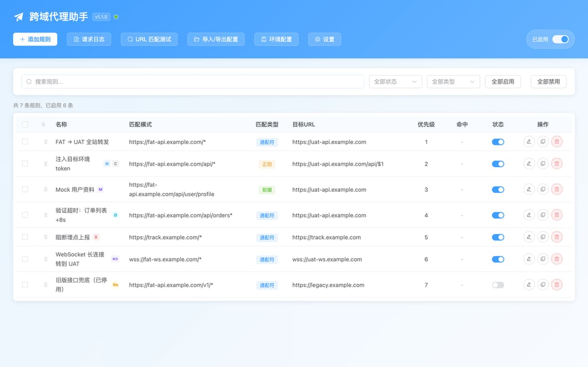

<div align="center">

# 跨域代理助手 - CORS 跨域调试 · API 环境切换 · Mock

[English](./README.md) | **简体中文**

**一条浏览器规则，把 FAT 前端指到 UAT 后端——不改代码、不改后端 CORS、不用重新构建。**

[](https://github.com/liaolongdong/cross-origin-proxy/stargazers)

<br/>



[](./LICENSE)
&nbsp;
[](https://github.com/liaolongdong/cross-origin-proxy/actions/workflows/ci.yml)
&nbsp;
[](https://developer.chrome.com/docs/extensions/mv3/intro/)
&nbsp;
[](#安装)
&nbsp;
[](./CONTRIBUTING.md)

> 页面连着 FAT，你要的修复只在 UAT。传统做法要么改每个项目的 devServer 代理、要么硬塞一个 token、要么请后端放开 CORS 再发一次版。这里只需要在 Chrome 里加一条规则：匹配 `https://fat-api.example.com/*`，目标 `https://uat-api.example.com`。同一套规则还能改写请求头与响应、Mock 数据、注入延迟、阻断请求、转发 WebSocket。

[安装](#安装) · [工作原理](#工作原理) · [功能](#功能) · [使用场景](#使用场景) · [常见问题](#常见问题) · [参与贡献](./CONTRIBUTING.md)

</div>

---

## 它解决的是什么

跨环境联调通常要付出三样代价之一：改后端、改每个项目的配置、或者在本地伪造一份构建。这个扩展把它们收敛成浏览器里的一条规则。

| 不用它                                                    | 用一条规则                                             |
| --------------------------------------------------------- | ------------------------------------------------------ |
| 改 devServer 代理表，然后重启本地服务                     | 保存一条通配规则，立刻生效，且对浏览器里所有项目都生效 |
| 请后端把来源加进 `Access-Control-Allow-Origin` 并重新发版 | 带高级能力的请求由扩展代发，页面侧不触发 CORS 校验     |
| 在源码里硬写另一个环境的 token，还得记得改回来            | 按规则注入请求头，联调完把这条规则关掉                 |
| 接口还没写好，只能先在前端塞假数据                        | 在规则里 Mock 响应，业务代码一行不动                   |

技术栈：[WXT](https://wxt.dev) + Vue 3 + TypeScript + Element Plus + Vite，Manifest V3。

## 安装

需要较新版本的桌面 Google Chrome（Manifest V3）。Chrome 应用商店上架准备中，现阶段按下面方式加载本地构建产物。

```bash
git clone https://github.com/liaolongdong/cross-origin-proxy
cd cross-origin-proxy
pnpm install
pnpm build
```

1. 打开 `chrome://extensions`。
2. 开启右上角「开发者模式」。
3. 点「加载已解压的扩展程序」，选择 `.output/chrome-mv3`。

### 一分钟配出第一条规则

1. 点扩展图标，打开**代理开关**。
2. 点弹窗里的**规则管理**——配置页会带着新建规则表单打开。
3. 填写规则：

   | 字段     | 说明                                                          |
   | -------- | ------------------------------------------------------------- |
   | 匹配类型 | `通配符`（`https://fat-api.example.com/*`）、`前缀` 或 `正则` |
   | 匹配模式 | 要拦截的 URL 模式                                             |
   | 目标 URL | 命中后转发到的地址                                            |
   | 优先级   | 数值越小越先匹配                                              |

4. 刷新页面。命中已启用规则的请求会被代理，到**请求日志**里可以确认。

## 工作原理

每条启用的规则在保存时被判定一次。只做 URL 重写的规则会编译成 `declarativeNetRequest` 动态规则，交给浏览器网络栈处理，单个请求零 JS 开销；能力更全的规则走后台通道。

```
页面 fetch / XHR / WebSocket
   │
   ├── 简单规则（仅 URL 重写）──► declarativeNetRequest 重定向
   │                              网络层完成转发，单请求零 JS 开销
   │
   └── 复杂规则 ─────────────────► 页面拦截器（MAIN world，postMessage）
                                      └► 桥接（ISOLATED world，chrome.runtime）
                                           └► 后台发起请求 ──► 响应回传页面
```

规则一旦带上下列任一项就不再是「简单规则」：请求头改写、请求体改写、响应改写、Mock、延迟、阻断、重试、HTTP 方法过滤、查询参数注入、`ws://`/`wss://` 目标、不以 `*` 结尾的通配符、目标地址留空。这些条件不是因为实现偷懒，而是网络层确实无法表达，详见 [utils/urlMatcher.ts](./utils/urlMatcher.ts)。

**关于 CORS，说准确一点。** 后台通道的请求由扩展（持有站点权限）发出，页面拿到的是扩展构造的响应，因此不受页面 CORS 校验约束。而纯网络层重定向，浏览器仍会校验重定向后响应的 `Access-Control-Allow-Origin`。如果目标环境没放行你的来源，给规则加上任意一项能力（最省事的是加个响应头改写），它就切到后台通道。

**兜底行为。** 拦截失败时页面会回退到原生 `fetch` / `XMLHttpRequest` / `WebSocket`，请求照常发出，不会因为扩展异常而中断。阻断规则是唯一的例外——被阻断的请求绝不回退发出。

## 功能

### 代理与请求改写

- **规则化 URL 重写**——按通配符、前缀、正则匹配后转发到目标环境
- **请求头改写**——按规则注入或替换请求头（例如目标环境的鉴权 token）
- **请求体改写**——用自定义内容替换原始请求体
- **响应改写**——改写响应状态码、响应头，或按点分路径替换 JSON 字段（如 `data.token`）
- **Mock 响应**——不访问任何服务，直接返回自定义 JSON / 文本 / HTML / XML
- **条件化 Mock**——可挂多组条件（URL 正则、HTTP 方法、查询参数），首个命中的条件决定响应体、状态码与 Content-Type
- **延迟注入**——0–60000 毫秒人工延迟，用来验证加载态与超时分支
- **请求阻断**——命中即网络错误，用来验证异常处理与离线兜底
- **失败重试**——网络错误或 5xx 响应时重新发出，0–5 次，间隔可配
- **HTTP 方法过滤**——把规则限定在指定方法（GET/POST/PUT…），留空表示任意方法
- **查询参数注入**——在最终代理地址上追加或覆盖参数（`__env=uat`、灰度标识），不必整段重写 URL
- **WebSocket 代理**——按 URL 重写转发 `ws://` / `wss://` 连接，由页面拦截器处理

### 规则管理

- 可视化表单新增 / 编辑 / 复制 / 删除
- **快速模板**覆盖常见写法（通配符 API 代理、前缀路径、鉴权头、自定义头覆盖），删除后还可立即**撤销**
- **拖拽排序**优先级（拖动 ⠿ 手柄）
- **能力徽标**一眼看清规则做了什么：**H** 请求头 · **B** 请求体 · **R** 响应 · **M** Mock · **D** 延迟 · **X** 阻断 · **WS** WebSocket
- 单条与批量启用 / 禁用
- **批量迁移目标域名**——选中多条规则做查找替换，带逐条变更预览
- 按名称、模式、状态搜索筛选
- **遮蔽冲突提示**——当被同模式更高优先级规则遮蔽时，编辑中即时提醒，避免写下一条永远不会命中的规则

### 日志与调试

- 请求日志面板：方法、状态、耗时，以及两条通道各自的命中统计（DNR 近 5 分钟、后台服务线程自配置变更起）
- 日志详情：完整请求/响应头与 body，JSON 自动格式化
- 任意一条日志**复制为 cURL**，也可直接**由这条请求创建规则**
- 按方法、状态、规则、URL 关键字筛选
- 顶栏** URL 匹配预演**：输入任意地址（可再选 HTTP 方法），实时看到命中规则、重写后的地址、转发通道与被遮蔽规则

### 导入导出与环境

- 配置以 JSON 导入导出
- **HAR 1.2** 导出抓到的请求；导入 HAR 会依据录制请求自动生成代理规则
- **cURL 导入**——粘贴 DevTools 的 Copy as cURL 结果即可解析并预填规则
- **环境配置快照**——把当前规则集存成命名快照，在 FAT / UAT / PROD 间一键切换
- 自动关闭倒计时（基于 `chrome.alarms`，后台脚本重启后仍然有效）与状态徽章

### 界面

- 弹窗快捷面板：总开关、今日统计、最近请求、自动关闭倒计时、**当前页面命中预演**，以及按当前标签页预填的「为本页创建规则」
- 中英文界面，6 套主题 + 浅色 / 深色 / 跟随系统
- 快捷键：<kbd>⌘</kbd>+<kbd>⇧</kbd>+<kbd>P</kbd> 切换代理、<kbd>⌘</kbd>+<kbd>N</kbd> 新建规则、<kbd>/</kbd> 聚焦搜索、<kbd>Esc</kbd> 关闭弹窗

## 使用场景

| 场景                           | 怎么配                                     |
| ------------------------------ | ------------------------------------------ |
| 在 FAT 页面验证只在 UAT 的改动 | API 前缀通配重写到 UAT 域名                |
| 后端还没开发完，先把前端做完   | Mock 响应，自定义 body 与状态码            |
| 验证加载态、骨架屏与超时       | 对指定接口注入 3000–60000 毫秒延迟         |
| 验证 500 与离线兜底 UI         | 阻断请求，或改写响应状态码                 |
| 走灰度分支或 A/B 策略          | 查询参数注入                               |
| 联调实时推送等长连接           | WebSocket 重写                             |
| 只把写操作打到测试后端         | 方法过滤，仅放行 `POST` / `PUT` / `DELETE` |
| 把同一套配置交给同事           | 导出 JSON，或分享由 HAR 生成的规则集       |

## 常见问题

<details open>
<summary><strong>它能绕过 CORS 吗？</strong></summary>

后台通道的规则可以：请求由持有站点权限的扩展发出，页面拿到的是扩展构造的响应，页面侧 CORS 校验不会触发。纯 URL 重写会被编译成网络层重定向，浏览器仍会校验 `Access-Control-Allow-Origin`。给规则加上任意一项能力，它就切到后台通道。

</details>

<details>
<summary><strong>所有网站都能用吗？</strong></summary>

内容脚本注入全部 `http` / `https` 页面，规则按请求 URL 匹配，内网系统、`localhost` 开发服务、预发域名都适用。`chrome://` 页面、应用商店页与其他扩展页面是 Chrome 对所有扩展的统一限制，无法注入。

</details>

<details>
<summary><strong>数据会被上传吗？</strong></summary>

不会。规则、日志、环境配置与偏好全部留在本机 `chrome.storage.local`，没有统计埋点，也不连接任何自有服务，唯一的网络流量就是你要求代理的 API 流量。详见[隐私政策](https://liaolongdong.github.io/cross-origin-proxy/privacy.html)（中英双语同页）。

</details>

<details>
<summary><strong>为什么我的规则走的是慢通道？</strong></summary>

因为它带了网络层无法表达的能力；也可能是通配符不以 `*` 结尾、或目标地址留空——这两种情况若强行编译成重定向会静默改变结果。用 URL 匹配预演就能看到每条地址实际走的通道。

</details>

<details>
<summary><strong>有哪些限制？</strong></summary>

规则 200 条、日志最近 500 条、请求体上限 10MB、延迟 0–60000 毫秒；Mock 与响应改写的状态码钳制在 200–599，否则前端构造不出合法的 `Response`。

</details>

<details>
<summary><strong>支持 Firefox 或 Edge 吗？</strong></summary>

按 Chrome（MV3）构建与验证。Edge 兼容 Chromium 扩展，同一份构建通常可用；Firefox 因 `declarativeNetRequest` 支持差异，目前不作为支持目标。

</details>

## 权限

| 权限                            | 用途                                               |
| ------------------------------- | -------------------------------------------------- |
| `storage`                       | 本地保存规则、日志、环境配置与偏好                 |
| `declarativeNetRequest`         | 为简单规则安装网络层重定向，做到单请求零 JS 开销   |
| `declarativeNetRequestFeedback` | 读取规则命中情况，用于日志抽屉的命中统计           |
| `alarms`                        | 后台脚本保活与自动关闭倒计时                       |
| `<all_urls>`（站点权限）        | 代理必须能在任意前端来源上工作，目标域名由你自己配 |

每项权限面向商店审核的说明文案在 [CHROMEWEBSTORE.md](./CHROMEWEBSTORE.md)。

## 开发

```bash
pnpm dev          # WXT 开发服务，端口 8899 热更新
pnpm build        # 生产构建 → .output/chrome-mv3
pnpm build:zip    # 构建并打包 zip（商店上传用）
pnpm test         # vitest 单元测试
pnpm typecheck    # tsc --noEmit
pnpm lint         # eslint（自动修复：pnpm lint:fix）
pnpm lint:style   # stylelint（recess-order 属性排序）
pnpm format:check # prettier（自动格式化：pnpm format）
pnpm assets       # 重新生成商店图与落地页图
```

需要 Node.js 20+ 与 pnpm 10（以 `packageManager` 为准）。CI 会在每次 push 与 PR 上跑 lint、typecheck、stylelint 与测试，见 [.github/workflows/ci.yml](./.github/workflows/ci.yml)。

### 目录结构

```
entrypoints/            WXT 入口：background（含各子模块）、内容脚本、options、popup
  background/           autoOff · badgeManager · dnrManager · dnrStats · keepalive · messageRouter · proxyHandler
  main-interceptor.content.ts   MAIN world 的 fetch/XHR/WebSocket 拦截器（按设计必须自包含）
  content.ts           ISOLATED world 与后台脚本之间的桥接
components/options/     配置页 UI（App.vue 负责装配；弹窗与抽屉用 defineAsyncComponent 异步加载）
composables/            响应式状态与副作用
utils/                  与框架无关的领域逻辑：urlMatcher · dnrRules · storage · curlParser · har · i18n · theme …
locales/                应用内界面文案（zh_CN / en，分 common/options/popup 三个命名空间）
public/_locales/        仅放 manifest 的名称与描述
docs/                   GitHub Pages 产品站：index.html（英）· zh.html（中）· privacy.html · llms.txt
tests/                  Vitest 测试（node 环境）
```

### 更多操作细节

<details>
<summary>Mock 响应 · 延迟 · 阻断 · 响应改写</summary>

**Mock 响应**——在规则表单里打开 Mock Response，设置状态码（默认 200），选择 Content-Type（JSON / 文本 / HTML / XML），粘贴响应内容。后端接口还没就绪时最实用。

**请求延迟**——打开 Request Delay，设置毫秒数（0–60000），用来验证加载态、骨架屏与超时处理。

**请求阻断**——打开 Block Request。命中请求直接收到网络错误，这就是验证异常处理与离线兜底的方式。

**响应改写**——展开 Response Overrides，可设置状态码、新增或覆盖响应头，或按点分路径替换指定 JSON 字段（如 `data.token` → `"mock-token"`）。

</details>

<details>
<summary>拖拽排序 · HAR · cURL · 日志详情</summary>

**拖拽排序**——拖动任意行的 ⠿ 手柄。表格按数组顺序展示，拖拽会同时更新展示顺序与优先级数值。

**HAR**——导入导出对话框里「导出 HAR」会把后台通道抓到的请求下载为 `.har`；「导入 HAR」会依据录制条目自动创建代理规则。

**cURL 导入**——把 cURL 命令粘贴到「导入 cURL」区域（支持续行符与单双引号），点「解析并创建规则」。扩展会根据请求来源生成通配规则，并把请求头与请求体预填到改写区，确认后保存即生效。

**日志详情**——点击任意日志行展开详情：请求 URL、请求头、请求体、响应头与响应体（JSON 自动格式化）、错误信息，以及「复制为 cURL」按钮。

</details>

## 参与贡献

小修复也欢迎。请先读 [CONTRIBUTING.md](./CONTRIBUTING.md)：三步流程、国际化要求（每条可见文案都要同时补 `locales/zh_CN/` 与 `locales/en/`），以及提 PR 前必须通过的检查。

## 许可证

[MIT](./LICENSE) · Copyright (c) 2026 Better

---

<div align="center">

**如果它帮你省掉了一次后端发版，点个 Star 让更多前端同学看到它：**

[](https://github.com/liaolongdong/cross-origin-proxy/stargazers)
&nbsp;
[](https://liaolongdong.github.io/cross-origin-proxy/zh.html)

</div>
